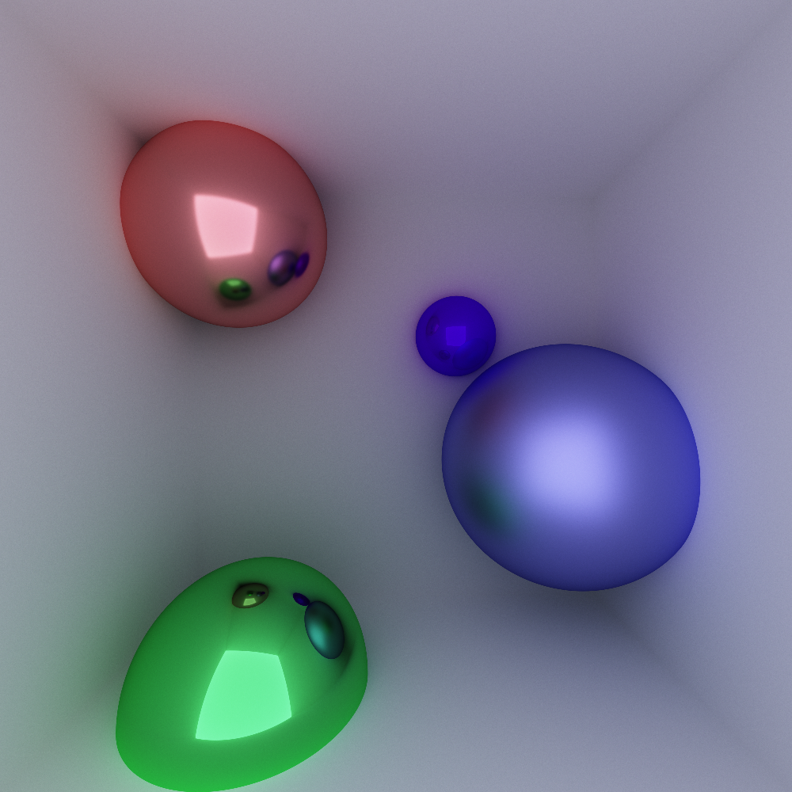

# Tenger's Path Tracer

Implementation of [path tracing](https://en.wikipedia.org/wiki/Path_tracing). All the work is done by a [fragment shader](https://github.com/StarikTenger/PathTracing/blob/master/PathTracing/PathTracing/shader.frag)

## Features
* backwards path tracing
* reflection
* diffuse reflection
* refraction

## Dependencies
* glew
* glut
* glm

# Results
Multicolored glass spheres

Different coefficients of diffusion reflection

Colored light sources
